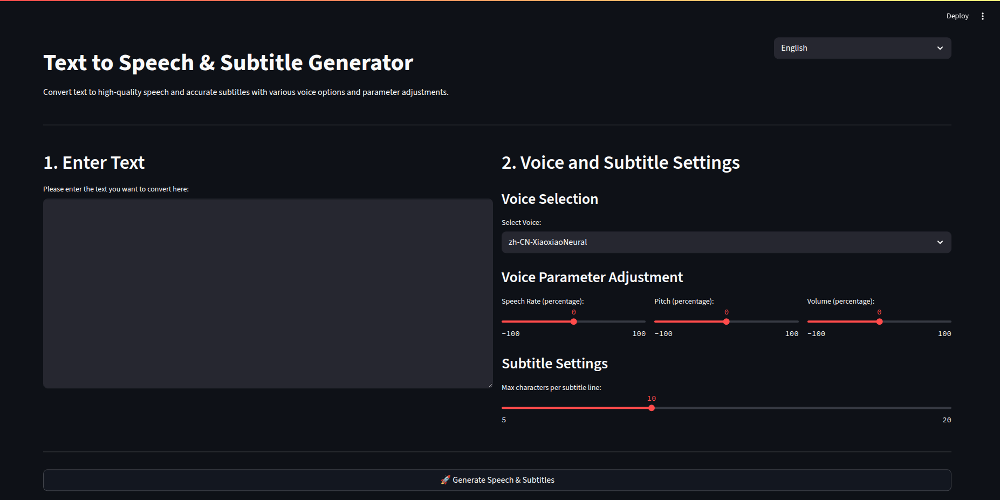
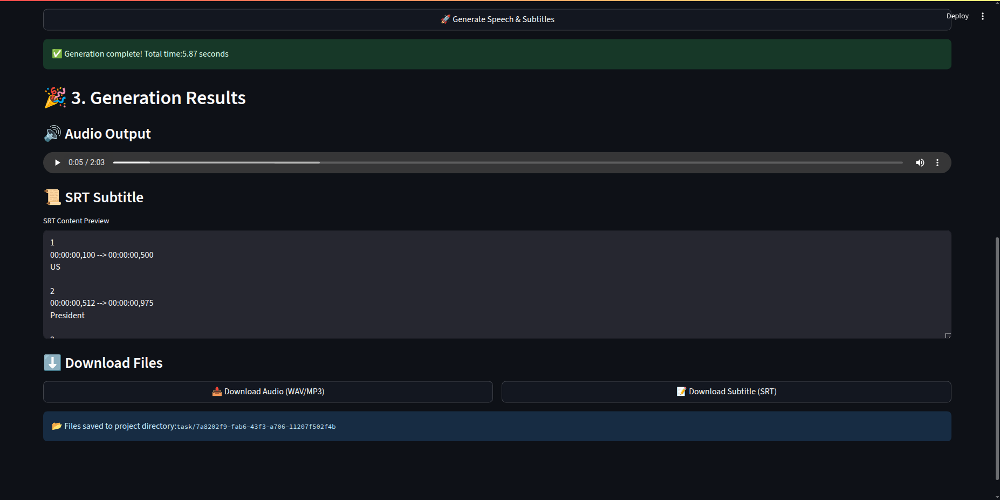

# text2srt_tts

[](https://github.com/sheng1111/text2srt_tts)
[](https://www.python.org/)
[](https://streamlit.io/)
[](https://opensource.org/licenses/MIT)
[](https://deepwiki.com/sheng1111/text2srt_tts)
[](https://colab.research.google.com/github/sheng1111/text2srt_tts/blob/main/colab_run.ipynb)

一鍵將文字轉換為高品質語音（WAV & MP3）與精準字幕（SRT），並在 Streamlit UI 中提供即時預覽和下載功能。支援多種語音選項與參數調整。

## ✨ 功能特色

-   **文字轉語音 (TTS)**：
    -   **預設引擎 (免費)**：`Edge TTS`，利用 Microsoft Edge 瀏覽器內建的語音合成功能，無需任何 API 金鑰。
    -   **高品質引擎 (選用)**：`Azure Speech Service`，提供更自然的語音。需在設定檔中填入您的 Azure API 金鑰。
    -   **自動備援**：若 Azure TTS 因故失敗，會自動降級改用 Edge TTS。
    -   可自訂語速、語調和音量。
    -   擷取單詞邊界資訊，以實現精確的字幕時間對齊。
-   **SRT 字幕生成**：
    -   根據單詞邊界自動將文字分割成行。
    -   可調整每行最大字數。
-   **Streamlit 使用者介面**：
    -   直觀的網頁介面，支援文字輸入、語音選擇、參數調整。
    -   即時預覽語音和字幕。
    -   提供 WAV/MP3 語音檔和 SRT 字幕檔的下載連結。
    -   每次生成都會在 `task/` 資料夾下建立獨立的 `task_id` 子資料夾來儲存結果。
-   **Docker 支援**：
    -   包含 `Dockerfile` 和 `docker-compose.yml`，便於快速設定和部署。
-   **命令列介面 (CLI)**：
    -   提供一個簡單的 CLI，可從文字檔案生成語音和字幕。
-   **Google Colab 支援**：
    -   提供專用的 Colab 筆記本，讓使用者無需本地環境設定即可在雲端運行專案。

## 📸 截圖預覽

### Streamlit 設定畫面



### 生成結果畫面



## 📂 專案結構

```
text2srt_tts/
├─ app/
│  ├─ services/             # 語音合成與字幕生成核心服務
│  │  ├─ voice.py           # 語音合成 (TTS) 邏輯 (Azure & Edge)
│  │  └─ subtitle.py        # 字幕生成邏輯
│  ├─ ui/                   # Streamlit 使用者介面
│  │  └─ gui.py             # Streamlit 應用程式入口
│  ├─ utils/                # 通用工具函數
│  │  └─ text_to_srt.py     # 將文字和時間戳轉換為 SRT 格式
│  └─ cli/                  # 命令列介面
│     └─ __main__.py        # CLI 入口點
├─ docs/
│  └─ img/                  # 專案截圖存放處
├─ task/                     # 生成的語音和字幕檔案存放處 (會被 .gitignore 忽略)
│  └─ {task_id}/            # 每個生成任務的獨立資料夾
│     ├─ output.wav
│     └─ output.srt
├─ config.example.toml       # 設定檔範本 (Azure 金鑰、FFmpeg 路徑、語音選項等)
├─ requirements.txt          # Python 依賴套件列表
├─ README.md                 # 專案說明 (繁體中文)
├─ README-EN.md              # 專案說明 (英文)
├─ colab_run.ipynb           # Google Colab 運行筆記本
└─ .gitignore                # Git 忽略檔案設定
```

## 🚀 安裝與設定

1.  **克隆專案**：
    ```bash
    git clone https://github.com/sheng1111/text2srt_tts.git
    cd text2srt_tts
    ```

2.  **建立虛擬環境並安裝所需套件**：
    強烈建議使用虛擬環境來管理專案依賴。
    ```bash
    python3 -m venv .venv
    source .venv/bin/activate  # Linux/macOS
    # .venv\Scripts\activate   # Windows (在 PowerShell 中可能需要執行 Set-ExecutionPolicy RemoteSigned -Scope Process)
    pip install -r requirements.txt
    ```

3.  **(選用) 安裝 ffmpeg**：
    若需轉換為 MP3 格式，您的系統上必須安裝 ffmpeg。您可以從 [ffmpeg 官網](https://ffmpeg.org/download.html) 下載並安裝。安裝後，請確保 `ffmpeg` 命令可以在您的終端機中執行。

4.  **設定 `config.toml` (選用)**：
    複製設定檔範本並進行編輯：
    ```bash
    cp config.example.toml config.toml
    ```
    -   **Azure 金鑰 (選用)**：若要使用品質更高的 Azure 語音服務，請在 `config.toml` 的 `AZURE_KEY` 和 `AZURE_REGION` 欄位填入您的金鑰。**若將此處留空，程式將自動使用免費的 Edge TTS。**
    -   **ffmpeg 路徑 (選用)**：如果 `ffmpeg` 未設定在您系統的 PATH 環境變數中，請在 `ffmpeg_path` 欄位指定其執行檔的絕對路徑。
    -   **語音**：您可以在 `[voices]` 區塊中新增或修改語音。可用的語音清單請參閱 [Azure 語音服務文件](https://aka.ms/speech/voices/neural)。

## ▶️ 使用方式

### Streamlit 網頁介面

在專案根目錄下，啟動 Streamlit 應用程式：

```bash
source .venv/bin/activate # 確保虛擬環境已啟動
python -m streamlit run app/ui/gui.py
```

這會在您的瀏覽器中開啟應用程式 (通常是 `http://localhost:8501`)。

**語言選擇：**

Streamlit UI 現在支援多種語言。您可以使用應用程式右上角的下拉選單在繁體中文（臺灣）和英文之間切換。

### Docker

若要使用 Docker 執行應用程式，請確保您已安裝 Docker 和 Docker Compose：

```bash
docker-compose build
docker-compose up
```

應用程式將會啟動於 `http://localhost:8501`。

### 命令列介面 (CLI)

在專案根目錄下，使用 CLI 生成語音和字幕：

```bash
source .venv/bin/activate # 確保虛擬環境已啟動
python -m app.cli --text input.txt --lang zh-CN-XiaoxiaoNeural --out output_folder/
```

-   `--text`: 輸入文字檔案的路徑 (例如 `input.txt`)。
-   `--lang`: 要使用的語音名稱 (例如 `zh-CN-XiaoxiaoNeural`)。請參考 `config.toml` 中的語音設定。
-   `--out`: 語音和字幕檔案的輸出目錄。如果目錄不存在，將會自動建立。

### Google Colab

點擊上方的 [](https://colab.research.google.com/github/sheng1111/text2srt_tts/blob/main/colab_run.ipynb) 徽章，即可在 Google Colab 中直接打開並運行專案。筆記本中包含了所有必要的設定和啟動步驟。

## 🧪 測試

若要執行單元測試，請在虛擬環境中運行以下指令：

```bash
source .venv/bin/activate # 確保虛擬環境已啟動
pytest
```

## 🤝 貢獻

歡迎任何形式的貢獻！如果您有任何建議、錯誤報告或功能請求，請隨時在 GitHub 上提交 Issue 或 Pull Request。

## 📄 授權

本專案採用 MIT 授權條款。詳情請參閱 [LICENSE](LICENSE) 檔案。