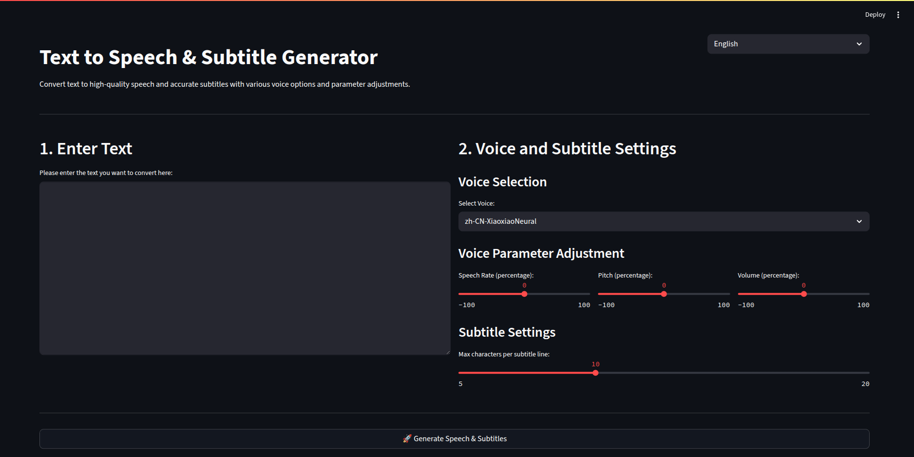

# text2srt_tts

[](https://github.com/sheng1111/text2srt_tts)
[](https://www.python.org/)
[](https://streamlit.io/)
[](https://opensource.org/licenses/MIT)
[](https://deepwiki.com/sheng1111/text2srt_tts)
[](https://colab.research.google.com/github/sheng1111/text2srt_tts/blob/main/colab_run.ipynb)

One-click conversion of text to high-quality speech (WAV & MP3) and accurate subtitles (SRT), with real-time preview and download functionality in a Streamlit UI. Supports various voice options and parameter adjustments.

## ✨ Features

-   **Text-to-Speech (TTS)**:
    -   **Default Engine (Free)**: `Edge TTS`, utilizing the built-in speech synthesis capabilities of Microsoft Edge browser, no API key required.
    -   **High-Quality Engine (Optional)**: `Azure Speech Service`, providing more natural-sounding speech. Requires your Azure API key in the configuration file.
    -   **Automatic Fallback**: If Azure TTS fails for any reason, it automatically falls back to Edge TTS.
    -   Customizable speed, pitch, and volume.
    -   Extracts word boundary information for precise subtitle timing.
-   **SRT Subtitle Generation**:
    -   Automatically splits text into lines based on word boundaries.
    -   Adjustable maximum characters per line.
-   **Streamlit User Interface**:
    -   Intuitive web interface supporting text input, voice selection, and parameter adjustments.
    -   Real-time preview of audio and subtitles.
    -   Provides download links for WAV/MP3 audio files and SRT subtitle files.
    -   Each generation creates a separate `task_id` subfolder under the `task/` directory to store results.
-   **Docker Support**:
    -   Includes `Dockerfile` and `docker-compose.yml` for easy setup and deployment.
-   **Command-Line Interface (CLI)**:
    -   Provides a simple CLI to generate speech and subtitles from a text file.
-   **Google Colab Support**:
    -   Offers a dedicated Colab notebook, allowing users to run the project in the cloud without local environment setup.

## 📸 Screenshots

### Streamlit Settings Interface



### Generated Results Interface


## 📂 Project Structure

```
text2srt_tts/
├─ app/
│  ├─ services/             # Core services for speech synthesis and subtitle generation
│  │  ├─ voice.py           # Speech synthesis (TTS) logic (Azure & Edge)
│  │  └─ subtitle.py        # Subtitle generation logic
│  ├─ ui/                   # Streamlit user interface
│  │  └─ gui.py             # Streamlit application entry point
│  ├─ utils/                # General utility functions
│  │  └─ text_to_srt.py     # Converts text and timestamps to SRT format
│  └─ cli/                  # Command-Line Interface
│     └─ __main__.py        # CLI entry point
├─ docs/
│  └─ img/                  # Location for project screenshots
├─ task/                     # Generated audio and subtitle files (ignored by .gitignore)
│  └─ {task_id}/            # Separate folder for each generation task
│     ├─ output.wav
│     └─ output.srt
├─ config.example.toml       # Configuration file template (Azure key, FFmpeg path, voice options, etc.)
├─ requirements.txt          # List of Python dependencies
├─ README.md                 # Project README (Traditional Chinese)
├─ README-EN.md              # Project README (English)
├─ colab_run.ipynb           # Google Colab notebook for running the project
└─ .gitignore                # Git ignore file settings
```

## 🚀 Installation & Setup

1.  **Clone the repository**:
    ```bash
    git clone https://github.com/sheng1111/text2srt_tts.git
    cd text2srt_tts
    ```

2.  **Create a virtual environment and install required packages**:
    It is highly recommended to use a virtual environment to manage project dependencies.
    ```bash
    python3 -m venv .venv
    source .venv/bin/activate  # Linux/macOS
    # .venv\Scripts\activate   # Windows (You might need to run Set-ExecutionPolicy RemoteSigned -Scope Process in PowerShell)
    pip install -r requirements.txt
    ```

3.  **(Optional) Install ffmpeg**:
    If you need to convert to MP3 format, you must have ffmpeg installed on your system. You can download and install it from the [ffmpeg official website](https://ffmpeg.org/download.html). After installation, ensure that the `ffmpeg` command is executable in your terminal.

4.  **Configure `config.toml` (Optional)**:
    Copy the configuration file template and edit it:
    ```bash
    cp config.example.toml config.toml
    ```
    -   **Azure Key (Optional)**: If you want to use the higher-quality Azure Speech Service, fill in your `AZURE_KEY` and `AZURE_REGION` in `config.toml`. **If left blank, the application will automatically use the free Edge TTS.**
    -   **ffmpeg Path (Optional)**: If `ffmpeg` is not set in your system's PATH environment variable, specify the absolute path to its executable in the `ffmpeg_path` field.
    -   **Voices**: You can add or modify voices in the `[voices]` section. A list of available voices can be found in the [Azure Speech Service documentation](https://aka.ms/speech/voices/neural).

## ▶️ Usage

### Streamlit Web Interface

From the project root directory, launch the Streamlit application:

```bash
source .venv/bin/activate # Ensure virtual environment is activated
python -m streamlit run app/ui/gui.py
```

This will open the application in your web browser (usually at `http://localhost:8501`).

**Language Selection:**

The Streamlit UI now supports multiple languages. You can switch between Traditional Chinese (Taiwan) and English using the dropdown menu located in the top right corner of the application.

### Docker

To run the application using Docker, ensure you have Docker and Docker Compose installed:

```bash
docker-compose build
docker-compose up
```

The application will be available at `http://localhost:8501`.

### Command-Line Interface (CLI)

From the project root directory, use the CLI to generate speech and subtitles:

```bash
source .venv/bin/activate # Ensure virtual environment is activated
python -m app.cli --text input.txt --lang zh-CN-XiaoxiaoNeural --out output_folder/
```

-   `--text`: Path to the input text file (e.g., `input.txt`).
-   `--lang`: The voice name to use (e.g., `zh-CN-XiaoxiaoNeural`). Refer to the voice settings in `config.toml`.
-   `--out`: Output directory for audio and subtitle files. If the directory does not exist, it will be created automatically.

### Google Colab

Click the [](https://colab.research.google.com/github/sheng1111/text2srt_tts/blob/main/colab_run.ipynb) badge above to open and run the project directly in Google Colab. The notebook contains all necessary setup and launch steps.

## 🧪 Testing

To run the unit tests, execute the following command within your virtual environment:

```bash
source .venv/bin/activate # Ensure virtual environment is activated
pytest
```

## 🤝 Contributing

Contributions of any kind are welcome! If you have any suggestions, bug reports, or feature requests, feel free to submit an Issue or Pull Request on GitHub.

## 📄 License

This project is licensed under the MIT License. See the [LICENSE](LICENSE) file for details.
